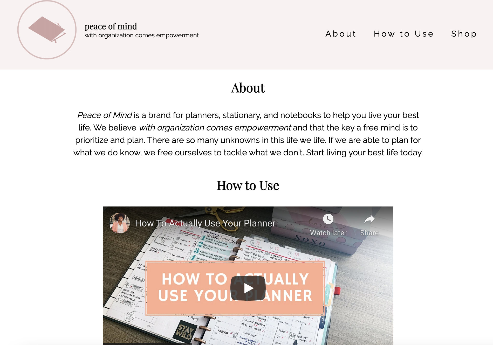
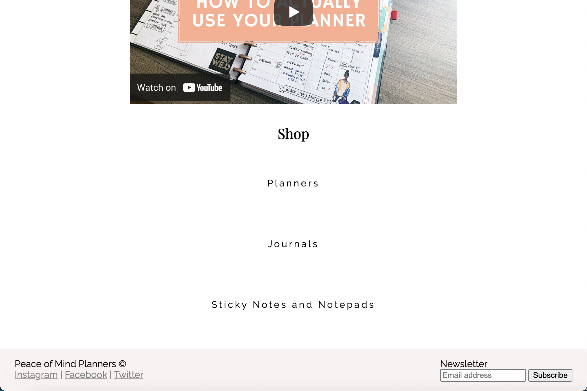
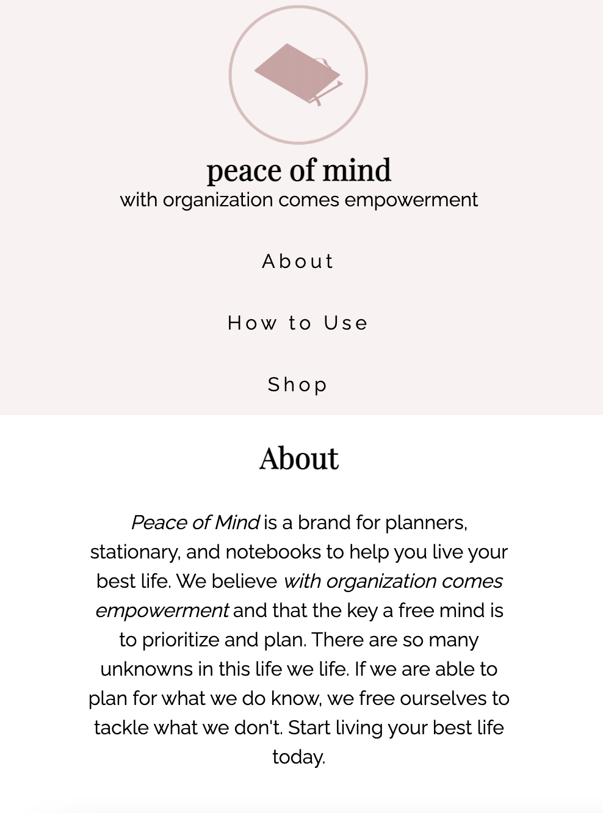
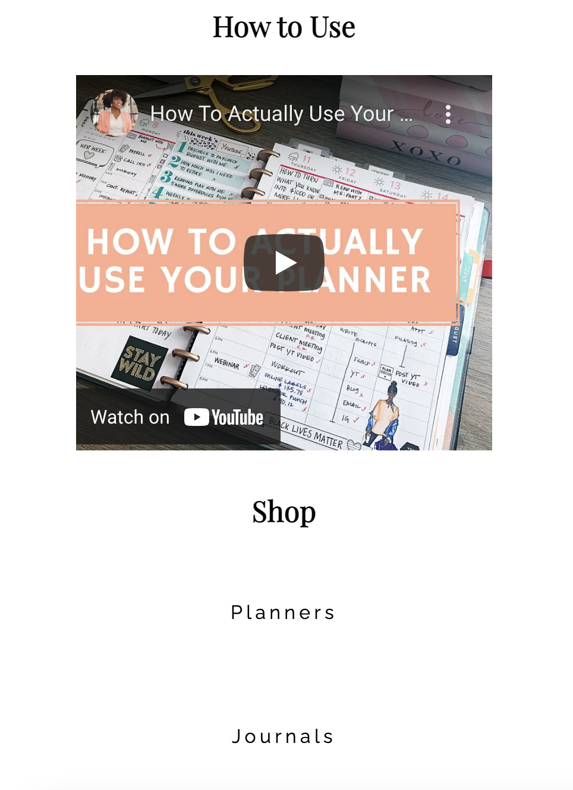
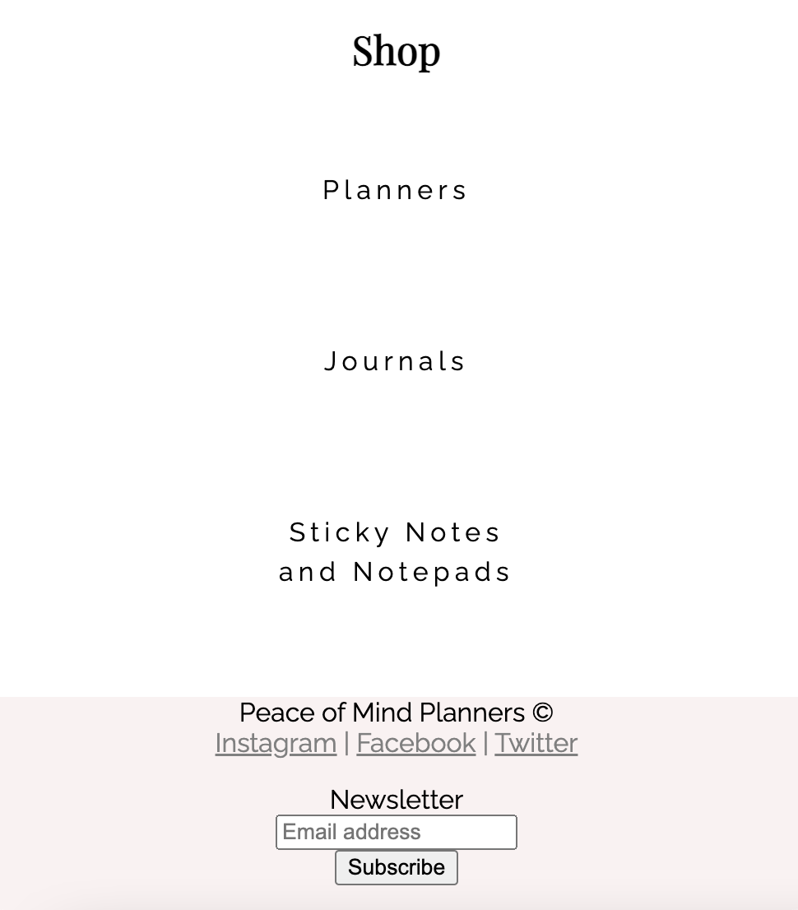

# fcc-product-landing-page
Live Site: [Product Landing Page](https://kaykaym01.github.io/fcc-product-landing-page/)

Challenge Description: [FreeCodeCamp: Responsive Web Design Product Landing Page](https://www.freecodecamp.org/learn/responsive-web-design/responsive-web-design-projects/build-a-product-landing-page)

This project is a part of FreeCodeCamp's Responsive Web Design course. The challenge is to create a tribute page similar to this: https://codepen.io/freeCodeCamp/full/RKRbwL

Desktop Screenshot:

Mobile Screenshots:

Required Elements:
* Header Element
* Nav Element, Fixed to Top
* Embedded Product Video
* Form Element for Email
* Media Query 
* CSS Flexbox

Skills Demonstrated:
* Responsive Web Design
* HTML
* CSS
